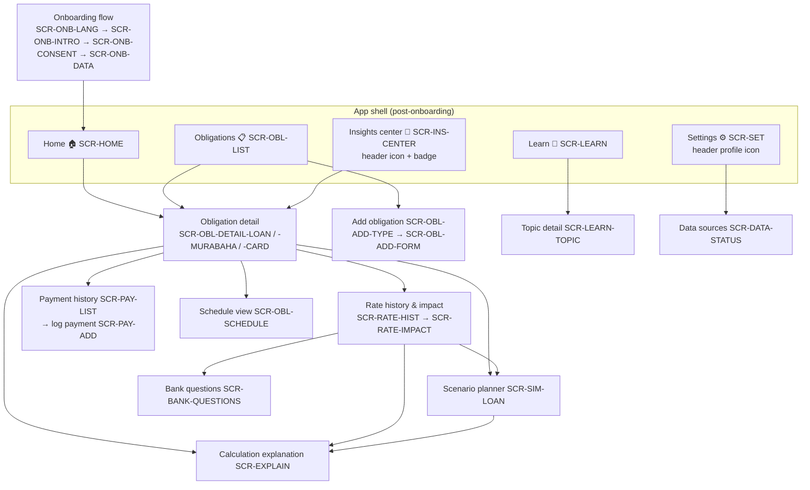

# Information Architecture & Navigation

**Decision:** 3-tab bottom navigation (DEC-002, challenged from SRC-1 §11's 4-tab proposal — rationale in `docs/00-audit/01-critique-and-recommendations.md §2.1`).

## 1. Structure

## 2. Navigation rules

| Rule | Detail |
|------|--------|
| NAV-1 | Tabs preserve their own stacks (standard mobile expectation; differs from web SPA history — see mobile primer §Navigation). |
| NAV-2 | Obligation detail is one route with type-driven layout (`/obligation/[id]`), not three routes — the subtype union decides the rendered sections (ADR-0008). |
| NAV-3 | `SCR-EXPLAIN` is a reusable modal/sheet parameterized by a calculation-run id — every derived figure everywhere opens the same component (PRIN-2). |
| NAV-4 | The scenario planner is *always entered with an obligation in context* — no global picker (DEC-002). |
| NAV-5 | Deep links (`eltizamati://obligation/{id}`, `.../insights`) validate the route allow-list and re-resolve entities by id (NFR-SEC-005). Insights use deep links internally today so future push notifications reuse them unchanged. |
| NAV-6 | Android back button: predictable stack pop; from tab roots, back exits (Android convention) — never traps the user. |
| NAV-7 | In RTL, stack "push" animates from the left; tab order mirrors (framework-provided; verify per screen in RTL pass). |

## 3. Why 3 tabs (decision record summary)

- **Home** answers "where do I stand" (the 10-second job). **Obligations** is the working list (browse/add/manage). **Learn** carries the education promise and gives judges/users a calm exploration space.
- **Plan** (SRC-1 proposal) failed the "one dominant purpose" test: a global planner's first screen is a picker — a hallway to a room, not a room. Planning re-enters where the user's question lives: on the obligation.
- **Payments** as a tab was already (correctly) conditioned on evidence in SRC-1; the same evidentiary bar removed Plan.
- Insights center as a header icon (not tab): its unread badge is the attention mechanism; frequency doesn't justify tab real estate in MVP. Revisit both post-MVP with usage data (documented trigger: if scenario usage per session > 1.5× obligation-detail visits, promote Plan).

## 4. Screen inventory index

Full specifications with states: `screen-inventory.md`. Count: 26 MVP screen specifications (the three obligation-detail variants share one route per NAV-2; modals included), 3 stretch.
