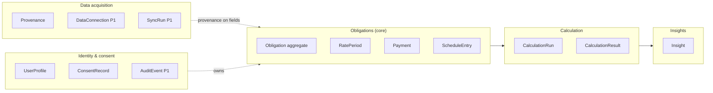

# Domain Model

**Home in code:** `packages/domain` (pure TypeScript, zero app/infra imports). Types below are normative; field lists are the contract for zod schemas, DB mapping (`docs/05-data-api/database-schema.md`), and the engine.
**Modeling decisions:** ADR-0008 (subtypes), ADR-0007 (value objects & engine isolation).

## 1. Bounded areas



Dependency rule inside the domain: `Insights → Calculation → Obligations → value objects`. Nothing in `packages/domain` imports UI, storage, or providers.

## 2. Value objects (`packages/domain/src/values/`)

| VO | Representation | Rules |
|----|----------------|-------|
| `Money` | decimal string + currency code, backed by decimal.js internally | No construction from `number` for amounts > integer-safe intent; arithmetic returns `Money`; rounding only via explicit `round(mode, dp)`; JOD dp=3. Raw `+ - * /` on money is lint-banned (NFR-MNT-003). |
| `Rate` | annual nominal percent as decimal string (e.g. "9.25") | ≥ 4 dp precision retained; conversion helpers `monthlyRate()` documented as convention CONV-2. |
| `LocalDate` | ISO `YYYY-MM-DD` string (no time, no TZ) | All financial dates are civil dates (BR-CALC-001); comparisons via helpers. |
| `Percentage` | decimal string | utilization, progress. |
| `Id<T>` | branded string (uuid) | prevents cross-entity id mixups. |
| `Provenance` | see `data-provenance.md` | attached to fields via `Sourced<T> = { value: T; provenance: Provenance }`. |
| `Confidence` | `'official' \| 'high' \| 'medium' \| 'low'` | semantics in calc spec §7. |

## 3. Obligation aggregate

### 3.1 Discriminated union (the subtype decision — ADR-0008)

```ts
type Obligation =
  | ConventionalLoan      // kind: 'conventionalLoan'  (personal/auto/housing via `purpose`)
  | MurabahaFinancing     // kind: 'murabaha'
  | IjaraFinancing        // kind: 'ijara'                       (P1)
  | DiminishingMusharakah // kind: 'diminishingMusharakah'       (P1)
  | CreditCard            // kind: 'creditCard'
  | GenericFacility       // kind: 'genericFacility'             (P1, read-only)
```

**Common core (every kind):** `id, kind, nickname, institution (name + optional id), currency ('JOD'), status (derived, never stored as truth — §5), openedDate?, closedDate?, createdAt, updatedAt, provenance (record-level), notes?`.

### 3.2 `ConventionalLoan`
`originalPrincipal: Sourced<Money>` · `outstandingBalance?: Sourced<Money>` · `installment: Sourced<Money>` · `rateType: 'fixed'|'variable'|'mixed'|'unknown'` · `ratePeriods: RatePeriod[]` (≥1; ordered, non-overlapping — BR-OBL-002) · `termMonths: Sourced<number>` · `startDate: LocalDate` · `maturityDate: LocalDate` (derived if absent) · `paymentFrequency: 'monthly'` (MVP; enum extensible) · `purpose?: 'personal'|'auto'|'housing'|'other'` · `firstPaymentDate?: LocalDate` · `contractualBalloon?: Sourced<Money>` (contract-designed balloon vs detected residual — distinct concepts, BR-CALC-013).

### 3.3 `MurabahaFinancing`
`assetCost: Sourced<Money>` · `disclosedProfit: Sourced<Money>` · `totalSalePrice: Sourced<Money>` (**fixed at contract** — invariant: assetCost + disclosedProfit = totalSalePrice within rounding, BR-OBL-003) · `installment: Sourced<Money>` · `termMonths` · `startDate` · `profitRateDisclosed?: Rate` (display-only fact, never used to recalculate — BR-CALC-020) · **no ratePeriods** (type-level impossibility of repricing UI).

### 3.4 `CreditCard`
`creditLimit: Sourced<Money>` · `currentBalance: Sourced<Money>` · `statementBalance?: Sourced<Money>` · `statementDate?: LocalDate` · `minimumPaymentRule?: { type: 'percent', value: Percentage, floor?: Money } | { type: 'fixed', value: Money } | { type: 'unknown' }` · `purchaseApr?: Sourced<Rate>` · `cashAdvanceApr?: Sourced<Rate>` · `dueDate?: LocalDate` · `graceDays?: number` · `fees?: FeeItem[]`.

### 3.5 Supporting entities

| Entity | Fields (essence) | Rules |
|--------|------------------|-------|
| `RatePeriod` | `id, obligationId, annualRate: Rate, effectiveFrom: LocalDate, source: Provenance` | Non-overlapping, ordered; first period starts at loan start (BR-OBL-002); changes append, never mutate history (BR-RATE-001) |
| `Payment` | `id, obligationId, date, amount: Money, allocation?: { principal: Money, cost: Money, allocationSource: 'official'\|'estimated' }, provenance, periodRef?` | Allocation sum = amount ± rounding tolerance (INV-2); estimated allocations labeled (BR-CALC-010) |
| `ScheduleEntry` | `periodIndex, dueDate, payment, principal, cost, closingBalance, rateApplied` | Engine output only — never hand-written |
| `CalculationRun` | `id, formulaId, formulaVersion, inputsSnapshot (canonical JSON), inputsHash, result, confidence, assumptions: AssumptionNote[], calculatedAt` | Reproducibility: same hash ⇒ same result (INV-5); persisted (FR-CALC-005) |
| `Insight` | `id, ruleId, obligationId?, severity: 'info'\|'attention'\|'urgent'\|'positive', title/body (i18n key + params), triggerInputs, deepLink, readAt?, createdAt` | Dedup key = `(ruleId, obligationId, hash(triggerInputs))` (FR-INS-004) |
| `ConsentRecord` | `docType, version, acknowledgedAt, locale` | Local in MVP; server-side P1 |
| `UserProfile` | `locale, dataMode: 'demo'\|'personal'`, display prefs | |

## 4. Obligation status model (BR-STAT-001)

Statuses (from SRC-1 §23, formalized): `onTrack, dueSoon, overdue, delinquent, attentionRequired, dataStale, calculationIncomplete, notStarted, completed, unknown`.

**Derivation is a single pure function** — `deriveObligationStatus(obligation, payments, insights, today): ObligationStatus` in `packages/domain/src/status/`. UI receives the enum; recomputing status anywhere else is a review-blocking defect.

Precedence (first match wins):
1. `completed` — closedDate set or balance ≤ 0 officially
2. `notStarted` — startDate > today
3. `delinquent` — unpaid ≥ 2 consecutive due periods (BR-STAT-003)
4. `overdue` — most recent due period unpaid, past due date + grace window (default 3 days, CONV-6)
5. `attentionRequired` — active `attention`-severity insight unresolved (e.g. residual risk)
6. `calculationIncomplete` — engine refused (BR-CALC-016) and no higher state
7. `dataStale` — provenance freshness beyond class threshold (BR-PROV-003) — P1 (network sources only)
8. `dueSoon` — next due ≤ 7 days (CONV-7)
9. `onTrack`
10. `unknown` — insufficient data to place in any state

Overall (dashboard) status = worst obligation status by the same precedence (BR-STAT-002). All thresholds are named constants in `domain/src/constants.ts` (no magic numbers), each with a CONV- id.

## 5. Business rules registry (referenced across docs)

| ID | Rule |
|----|------|
| BR-OBL-001 | An obligation's stored fields never mix currencies; currency fixed at creation. |
| BR-OBL-002 | Rate periods are contiguous, non-overlapping, ordered; validation rejects violations at entry (FR-RATE-002). |
| BR-OBL-003 | Murabaha: assetCost + disclosedProfit = totalSalePrice (rounding tolerance CONV-5); violation is a data error surfaced to the user, not auto-corrected. |
| BR-RATE-001 | Rate history is append-only; corrections create a superseding entry with provenance, never silent edits. |
| BR-STAT-001 | Status derives only from `deriveObligationStatus` (precedence above). |
| BR-STAT-002 | Aggregate status = worst component status. |
| BR-STAT-003 | Delinquency threshold: 2 consecutive unpaid periods (ASM — validate against local practice in RES-004). |
| BR-PROV-001…005 | See `data-provenance.md`. |
| BR-CALC-001…020 | See `financial-calculation-spec.md`. |
| BR-TERM-001/002 | See glossary / content rules. |

## 6. Domain events (in-process, MVP)

`ObligationAdded, ObligationUpdated, PaymentLogged, RateChangeLogged, CalculationCompleted, InsightRaised, InsightRead, DataErased, DemoDataLoaded` — emitted by application services; the insight rules engine subscribes to recalculation-relevant events (`PaymentLogged`, `RateChangeLogged`, `CalculationCompleted`). In-process event bus only (no infra); P1 sync can replay the same events.

## 7. What is deliberately absent

- No `Statement`, `Transaction`, `SyncRun`, `DataConnection` implementations in MVP (P1 with providers) — their shapes are sketched in `docs/05-data-api/api-and-providers.md` so the schema reserves them.
- No polymorphic table-per-hierarchy monster model, no event sourcing (evaluated and rejected in ADR-0008 — reversal path documented there).
