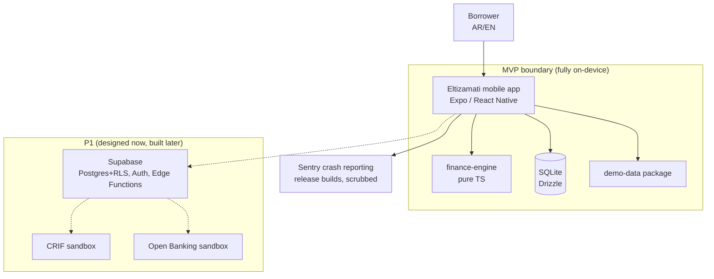
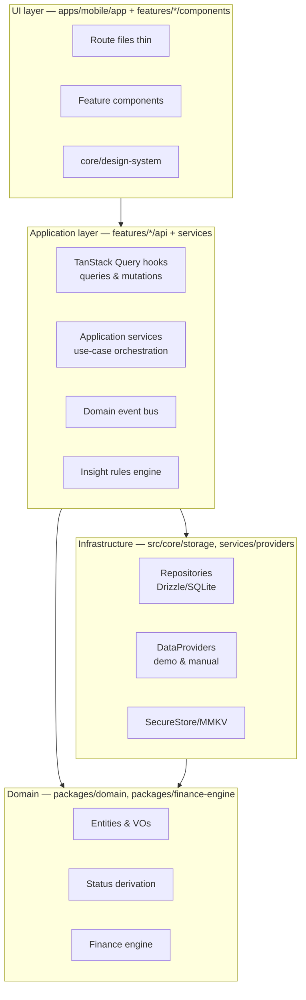
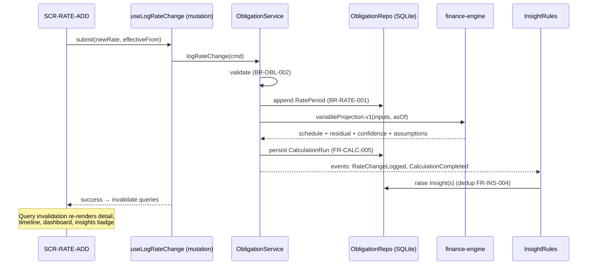

# System Architecture

> **⚠ Architecture update (2026-07-11, [ADR-0017](../09-decisions/ADR-0017-supabase-first-mvp-persistence.md)):** the MVP is now **Supabase-first**. Personal-mode data persists only in Supabase Postgres (Auth + RLS + generated types); demo mode runs from **bundled in-memory seed data** (no database, no network, no auth). **There is no SQLite in the MVP** — diagrams/sections below showing "SQLite (Drizzle)" should be read as: _demo mode → in-memory `Demo*Repository` over `packages/demo-data`; personal mode → `Supabase*Repository` over supabase-js_. Both implement the **same repository interfaces**, selected once at the composition root (`apps/mobile/src/services/composition-root.ts`) by the active `dataMode` — no code may branch on mode for business logic (ADR-0009 unchanged). Layering/dependency rules in §2 are unchanged and remain lint-enforced. Personal mode requires network for authoritative reads/writes (honest offline/error/retry states — no sync engine, no silently queued financial mutations). Source-of-truth rule: **Supabase for personal mode; seed builders for demo mode; the finance engine derives, never stores.** SQLite returns post-MVP: [FUTURE_LOCAL_FIRST_ROADMAP](../08-delivery/FUTURE_LOCAL_FIRST_ROADMAP.md).

**Stack summary (decisions in ADRs):** Expo (React Native) + TypeScript (ADR-0001) · pnpm monorepo (ADR-0003) · **Supabase-first MVP persistence (ADR-0017; supersedes ADR-0006/0013 for MVP)** · TanStack Query + Zustand (ADR-0004) · Expo Router (ADR-0005) · pure-TS finance engine (ADR-0007).

## 1. System context



**MVP truth:** no network required (NFR-REL-001). Provider secrets never exist client-side because P1 provider calls go through Supabase Edge Functions (NFR-SEC-001; non-negotiable §35.7) — the mobile app never talks to CRIF/Open Banking directly.

## 2. Mobile app layering & dependency direction (NFR-MNT-002)



**Rules (lint-enforced via dependency-cruiser):**

1. `UI → Application → Domain`; `Infrastructure → Domain`. Nothing imports upward. Domain packages import nothing from the app.
2. UI never touches repositories, SQLite, providers, or the engine directly — only query/mutation hooks and application services (anti-patterns: API/DB access from UI, business logic in widgets).
3. Raw persistence rows and provider payloads are mapped to domain types at the infrastructure boundary (mappers live beside repositories) — DB records never reach components (anti-pattern guard).
4. The engine is invoked only by application services, which persist `CalculationRun`s and emit events.

## 3. Data flow — the demo spine (rate change → insight → scenario)



One-way, predictable: **UI event → mutation → service → (repo, engine) → events → insights → query invalidation → UI**. No component computes financial state.

## 4. State management (ADR-0004)

| State kind               | Owner                                                              | Examples                                                     |
| ------------------------ | ------------------------------------------------------------------ | ------------------------------------------------------------ |
| Persistent domain data   | SQLite via repositories, exposed as TanStack Query caches          | obligations, payments, rates, runs, insights                 |
| Derived financial values | Never "state" — computed by engine via services, persisted as runs | projections, residuals                                       |
| Session/UI state         | Zustand (small, few stores)                                        | active locale, demo banner dismissal-in-session, form drafts |
| Preferences              | MMKV via typed `preferences` module                                | locale, onboarding done, consent ack pointers                |
| Navigation state         | Expo Router                                                        | stacks/tabs                                                  |

Rules: no global god-store (anti-pattern); a Zustand store per concern with typed selectors; TanStack Query keys centralized in `features/*/api/keys.ts` (no ad-hoc string keys).

## 5. Error architecture (taxonomy → ADR-0014)

- `AppError` discriminated union in `packages/domain/src/errors/`: `validation, notFound, dataConflict, dataIncomplete, calculationUnsupported, calculationRefused, storage, migration, unexpected` (+ P1: `auth, authorization, consent, connectivity, providerUnavailable, rateLimited, sync`).
- Each code carries: retryability, severity, safe-metadata whitelist, i18n key for user message, recovery action hint (SRC-1 §29 fields).
- Services return `Result<T, AppError>` (no thrown business errors); mutations map errors to UI states centrally; one `ErrorBoundary` + one `errorToMessage(locale)` mapper (no catch-all swallowing — anti-pattern).
- Logging: errors log code + safe metadata only (NFR-SEC-004).

## 6. Composition root & DI (deliberately minimal)

One file: `apps/mobile/src/services/composition-root.ts` constructs repositories (with the SQLite handle), providers, services (constructor injection), and exposes them via a single React context. No DI framework — at this scale a container adds ceremony without value (SRC-2 anti-pattern #25); constructor injection keeps everything testable (pass fakes in tests). Swapping demo↔manual↔(P1) providers happens here and nowhere else.

## 7. Repository layout (monorepo — ADR-0003)

```
eltizamati/
├── apps/mobile/
│   ├── app/                    # Expo Router routes (thin: parse params, render feature screen)
│   │   ├── (tabs)/index.tsx    # Home
│   │   ├── (tabs)/obligations/ # list
│   │   ├── (tabs)/learn/
│   │   ├── obligation/[id]/    # detail, schedule, rates, simulator
│   │   ├── onboarding/
│   │   └── settings/
│   ├── src/
│   │   ├── core/
│   │   │   ├── design-system/  # tokens, primitives (docs/02-ux/design-system.md)
│   │   │   ├── i18n/           # i18next setup, locales/, terminology namespaces
│   │   │   ├── formatting/     # formatMoney, formatDate (single home)
│   │   │   ├── storage/        # sqlite client, drizzle schema, migrations, mmkv, secure store
│   │   │   ├── errors/         # ErrorBoundary, errorToMessage
│   │   │   └── config/         # typed env/config, feature toggles (local)
│   │   ├── features/
│   │   │   ├── onboarding/  dashboard/  obligations/  payments/  rates/
│   │   │   ├── simulator/  insights/  education/  settings/  data-sources/
│   │   │   │   └── <feature>/{components,api,model,__tests__}   # identical shape, enforced
│   │   └── services/           # application services, event bus, insight rules, composition-root
│   ├── assets/  content/education/  maestro/   # E2E flows
│   └── app.config.ts  eas.json
├── packages/
│   ├── domain/                 # entities, VOs, zod schemas, status, errors, constants
│   ├── finance-engine/         # formulas, registry, vectors/, property tests
│   └── demo-data/              # seed factory (versioned), fixture builders for tests
├── supabase/                   # P1: migrations (RLS from first), seed.sql, functions/ — designed now
├── docs/                       # this knowledge base
├── .github/workflows/ci.yml
└── package.json  pnpm-workspace.yaml  turbo.json (optional later)
```

**Feature-folder law:** every feature has the same internal shape; a new pattern inside one feature is a review-blocking defect (AI_AGENT_RULES #13).

## 8. Naming standards

- Files: kebab-case (`rate-timeline.tsx`); components PascalCase; hooks `useX`; services `XService`; repos `XRepo`.
- Domain language in code mirrors the glossary code names (TERM registry) — e.g. `outstandingBalance`, never `remainingAmount` in one file and `balanceLeft` in another (BR-TERM-002).
- Query keys: `['obligations']`, `['obligation', id]`, `['insights', ...]` — defined once per feature in `api/keys.ts`.
- IDs: uuid v7 (sortable) generated at creation, branded types (`Id<'obligation'>`).
- i18n keys: `feature.screen.element` + `glossary.<term-id>` + terminology namespaces (content rules §1).

## 9. Mobile lifecycle concerns (details in `mobile-primer-for-web-devs.md`)

State restoration (process death), background execution limits, safe areas, keyboard handling, app-switcher privacy (P1: blur sensitive screens), permissions timing (notifications, S) — each mapped to concrete practices in the primer so web assumptions don't leak into implementation.
