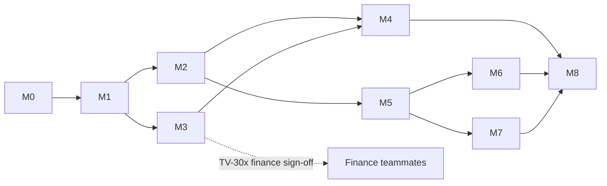

# Hackathon Delivery Plan

> **⚠ SUPERSEDED as the execution plan (2026-07-11).** The M0–M8 milestone plan below is replaced by the phase-based execution system in **[IMPLEMENTATION_PLAN.md](IMPLEMENTATION_PLAN.md)** (9 phases, Supabase-first per [ADR-0017](../09-decisions/ADR-0017-supabase-first-mvp-persistence.md); the M→Phase mapping is in that document). This file is retained for: the demo script (§4, still canonical), the traceability matrix (§3, migrated into the new plan), and historical context. **Do not implement from the milestone descriptions below** — M0's SQLite exit condition and M6's late-backend sequencing are superseded. ID fixes applied 2026-07-11: the §3 matrix rows formerly citing `US-014*`/`US-015*` for auth/mock-connect now map to **US-016/US-017** (defined in `user-stories.md`), and `SCR-AUTH-*`/`SCR-CONSENT`/`SCR-CONNECT` are now specced as **SCR-AUTH-SIGNIN/SIGNUP/RESET, SCR-CONSENT-PROVIDER, SCR-CONNECT-MOCK** in `screen-inventory.md`.

**Timeline (updated 2026-07-10):** the hackathon runs **~3 weeks** solo + AI (corrects the earlier unknown-duration assumption; GAP-02 partially closed, exact judging rules still RES-001). Below is a **week-mapped** plan. The governing rule is unchanged: **compress by cutting from the bottom (week-3 depth), never by cutting engine tests or the demo spine.**

**The one hard sequencing rule:** the money-shot spine — dashboard → rate change → residual → explanation → scenario — must be **green and airplane-mode-safe by the end of week 2** (through M4). Everything in week 3 (backend, auth, notifications, card simulator, hardening) is **additive and cuttable**; none of it may become a demo dependency (mvp-scope §5a).

## 0. Three-week calendar (indicative)

| Week  | Focus                                                     | Milestones                                             | Exit state                                        |
| ----- | --------------------------------------------------------- | ------------------------------------------------------ | ------------------------------------------------- |
| **1** | Foundation + data + dashboard; engine kickoff in parallel | M0, M1 (M3 formulas started against `packages/domain`) | Bilingual populated dashboard on device           |
| **2** | Detail screens + **the engine + scenario** ⭐             | M2, **M3, M4**                                         | **Demo spine green in airplane mode, AR+EN**      |
| **3** | Depth off the critical path, then harden                  | M5, **M6 (backend/identity), M7 (engagement)**, M8     | Preview APK, real backend demonstrable, rehearsed |

## 1. Milestones (each independently demoable — vertical slices)

### M0 — Foundation (the slice that proves the skeleton)

Monorepo scaffold (structure per system-architecture §7) · Expo app boots on device (dev build, MMKV-ready) · i18n AR/EN + RTL flip via settings · design tokens + `Screen/Text/Button/Card/Amount(placeholder)` primitives · SQLite + Drizzle + first migration · CI green (format/lint/typecheck/test/boundaries) · Sentry wired (preview) · README quickstart works.
**Exit demo:** bilingual "hello dashboard" shell with tab nav, on a phone, from a fresh clone.

### M1 — Demo data & dashboard

`packages/domain` core (Obligation union, Money/Rate/LocalDate, status derivation + tests) · `packages/demo-data` v1 (date-anchored) · DemoSeedProvider + ImportService + repos · onboarding flow (lang→intro→consent→data choice) · SCR-HOME with real aggregates (`aggregates.v1`) + obligation cards + demo banner · SCR-OBL-LIST.
**Exit demo:** onboard → populated bilingual dashboard, all states (empty/loading/demo).

### M2 — Loan detail & histories

SCR-OBL-DETAIL-LOAN (unknown-field handling) · SCR-PAY-LIST + SCR-RATE-HIST · SCR-OBL-DETAIL-MURABAHA (terminology-correct, `murabahaProgress.v1` + INV-7 tests) · SCR-OBL-DETAIL-CARD (display) · glossary tap-through (FR-EDU-001) with first 10 education entries.
**Exit demo:** browse all three obligations with correct terminology in both languages.

### M3 — The engine ⭐ (highest risk, most value — starts as early as possible in parallel)

`finance-engine`: `amortization.v1`, `variableProjection.v1`, `residualDetection.v1`, `allocationEstimate.v1` + registry + CalculationRun persistence · vectors TV-1xx/2xx passing; **TV-30x filled by finance teammates and passing** · property tests INV-1..7 · SCR-RATE-IMPACT + SCR-EXPLAIN + SCR-OBL-SCHEDULE · insight rules (RATE_INCREASED, INSTALLMENT_UNCHANGED, RESIDUAL_RISK) + SCR-INS-CENTER.
**Exit demo:** the money shot — open loan → see residual warning → tap → full explanation with assumptions.

### M4 — Scenario planner ⭐

`extraPaymentScenario.v1` + vectors · SCR-SIM-LOAN (side-by-side, boundary language) · SCR-BANK-QUESTIONS · perf budget check (NFR-PERF-002).
**Exit demo:** "+50 JOD" visibly erases the residual — the emotional resolution.

### M5 — Manual entry & settings

SCR-OBL-ADD-TYPE/FORM (3 kinds, consistency notice BR-CALC-017) · SCR-PAY-ADD, SCR-RATE-ADD (validations) · SCR-SET complete (language, erase-all + test, reset demo, acknowledgments) · SCR-DATA-STATUS.
**Exit demo:** judge's own loan entered live in <2 minutes.

### M6 — Backend & identity (week 3; off the critical demo path) ⭐ new

Supabase project + `/supabase` migrations deployed (schema already lockstepped with Drizzle — docs/05) · RLS policies from the first migration + pgTAP tests (NFR-SEC-002, FR-AUTH-006) · email auth: sign-up/verify/sign-in/reset/session (FR-AUTH-001) · SecureStore tokens · biometric app-lock (FR-AUTH-004) · versioned consent records server-backed (FR-AUTH-002) · account deletion + audit (FR-AUTH-003) · repository swap demo↔cloud behind the existing provider seam (no domain changes) · **consent-gated connect flow against the labeled-mock CRIF/Open-Banking provider** (FR-AUTH-005, FR-ONB-004) — Splash→Auth→Consent→Retrieve→Classify→Dashboard runs end-to-end against the mock.
**Exit demo:** create a real account, record consent, connect the mock source, see the unified profile persist to Supabase with RLS — _shown as a secondary beat; the scripted demo still runs in demo mode._
**Cut line:** if week 3 is short, ship auth+consent+RLS without the mock-connect flow; if shorter, defer the whole milestone — the local-first MVP stands alone.

### M7 — Engagement depth (week 3)

`cardPayoff.v1` + TV-6xx + card payoff simulator UI (FR-SIM-004, US-013) · local payment-due notifications (FR-NTF-001; permission UX, quiet hours, content-minimized) · user-defined threshold insight + reminder-day settings (FR-INS-001, FR-SET-006) · duplicate-payment detection (FR-PAY-004) · "two numbers" comparison hero on loan detail (SRC-4) + cumulative extra-interest on the rate timeline.
**Exit demo:** the card simulator and a scheduled reminder both work; loan detail leads with the two-numbers comparison.

### M8 — Hardening & demo polish (week 3 close)

Full AR walkthrough fixes (RES-009 review applied) · empty/error state sweep · Maestro demo-spine flows (EN+AR) green · a11y pass (labels, targets, contrast) · performance on demo device · security checklist (incl. auth/RLS/consent surfaces) · preview APK on 2 devices · demo script rehearsed ×3 (incl. the airplane-mode run).

### Stretch queue (only after M8, in order)

S1 JSON export (US, `FR-SET-004`) → S2 saved scenarios (FR-SIM-005) → S3 phone OTP factor (FR-AUTH-007) → S4 real CRIF/OB sandbox provider _if access is confirmed_ (RES-002).

## 2. Dependency graph

M3 (engine) can start against `packages/domain` as soon as M1's domain core exists — it has no UI dependency. If solo time-slicing: interleave M2 (UI-heavy) with M3 (logic-heavy) to avoid burnout on either. **M6 (backend) depends only on M5's repository/schema surface, not on the engine or the demo spine — it runs as an independent week-3 track and is the first thing cut if time is short.**

## 3. Traceability matrix (Phase-5 consistency check — MVP features)

| Feature              | FR                          | US         | SCR                          | BR/Formula                                           | Test                      | Milestone |
| -------------------- | --------------------------- | ---------- | ---------------------------- | ---------------------------------------------------- | ------------------------- | --------- |
| Onboarding + consent | FR-ONB-001..005             | US-001     | SCR-ONB-*                    | —                                                    | RNTL + Maestro            | M1        |
| Dashboard            | FR-OBL-001/002, FR-CALC-006 | US-002     | SCR-HOME                     | aggregates.v1, BR-PROV-004/005, BR-STAT-002          | TV-7xx + RNTL             | M1        |
| Loan detail          | FR-OBL-003                  | US-003/009 | SCR-OBL-DETAIL-LOAN          | BR-CALC-016                                          | RNTL states               | M2        |
| Murabaha             | FR-OBL-004                  | US-007     | SCR-OBL-DETAIL-MURABAHA      | murabahaProgress.v1, BR-TERM-001, BR-CALC-020, INV-7 | TV-5xx + terminology test | M2        |
| Card display         | FR-OBL-005                  | US-008     | SCR-OBL-DETAIL-CARD          | —                                                    | RNTL                      | M2        |
| Rate history/log     | FR-RATE-001/002             | US-003     | SCR-RATE-HIST/ADD            | BR-OBL-002, BR-RATE-001                              | unit + RNTL               | M2/M5     |
| Rate impact          | FR-RATE-003/004             | US-003     | SCR-RATE-IMPACT              | variableProjection.v1, residualDetection.v1          | TV-2xx/30x                | M3        |
| Explanation          | FR-CALC-001/005             | US-009     | SCR-EXPLAIN                  | run persistence                                      | unit + RNTL               | M3        |
| Insights             | FR-INS-001..004             | US-012     | SCR-INS-CENTER               | dedup rule                                           | rule unit tests           | M3        |
| Scenario             | FR-SIM-001..003             | US-004     | SCR-SIM-LOAN                 | extraPaymentScenario.v1, INV-3                       | TV-304 + Maestro          | M4        |
| Payments             | FR-PAY-001..003/005         | US-005     | SCR-PAY-LIST/ADD             | allocationEstimate.v1                                | TV-4xx                    | M2/M5     |
| Manual entry         | FR-OBL-006/007              | US-006     | SCR-OBL-ADD-*                | BR-CALC-017                                          | RNTL + Maestro            | M5        |
| Education            | FR-EDU-001..004             | —          | SCR-LEARN*                   | content format                                       | key-coverage              | M2/M6     |
| Settings/erase       | FR-SET-001..003/005         | US-010/011 | SCR-SET                      | —                                                    | absence test              | M5        |
| Data status          | FR-DATA-003                 | —          | SCR-DATA-STATUS              | provider registry                                    | RNTL                      | M5        |
| Auth & session       | FR-AUTH-001/006             | US-016     | SCR-AUTH-SIGNIN/SIGNUP/RESET | RLS policies                                         | RNTL + pgTAP              | M6        |
| Consent records      | FR-AUTH-002/005             | US-016     | SCR-CONSENT-PROVIDER         | consent versioning                                   | unit + RNTL               | M6        |
| Account deletion     | FR-AUTH-003                 | —          | SCR-SET                      | erasure + audit                                      | integration               | M6        |
| Mock connect flow    | FR-ONB-004, FR-AUTH-005     | US-017     | SCR-CONNECT-MOCK             | provider contract (mock)                             | RNTL + Maestro            | M6        |
| Card payoff sim      | FR-SIM-004                  | US-013     | SCR-SIM-CARD                 | cardPayoff.v1, INV-*                                 | TV-6xx + Maestro          | M7        |
| Local notifications  | FR-NTF-001, FR-SET-006      | —          | SCR-SET                      | scheduling + quiet hours                             | integration               | M7        |
| Duplicate detection  | FR-PAY-004                  | US-005     | SCR-PAY-ADD                  | dedup rule                                           | unit + RNTL               | M7        |

(US-016/US-017 defined in `user-stories.md` 2026-07-11 — the earlier `US-014*/US-015*` placeholders collided with the existing reminder/export stories and are retired.)
(Every MVP FR now appears; only FR-SET-004/FR-SIM-005/FR-AUTH-007/FR-NTF-002 remain out of MVP by design.)

## 4. Demo script (5 minutes) & fallbacks

1. _(20s)_ Hook: "Omar has three obligations at three institutions. His bank raised his rate 14 months ago. His installment never changed. He thinks that's fine." Open app (Arabic), dashboard: totals, three cards, one amber insight.
2. _(60s)_ Open loan → rate timeline → "installment unchanged" insight → impact screen: ≈ residual at maturity, ≈ added cost, "less of each payment reduces principal". Tap a figure → explanation: sources, formula version, assumptions — _"every number in this app can defend itself."_
3. _(60s)_ "What can I do?" → scenario +50 JOD → side-by-side: residual gone, N months earlier, ≈ X JOD saved → bank-questions checklist.
4. _(45s)_ Honesty beat: data-source screen — "demo data and manual entry today; CRIF/Open Banking are contracts we've built against a **labeled mock** — real access is a regulatory step, not a fake connection." Show Murabaha detail — "contract-aware, not word-swapped."
5. _(30s)_ **Secondary depth beat (optional, only if stable):** create a real account, record consent, connect the mock source → unified profile persists to Supabase with RLS. _"The local demo you just saw is the same app running offline; signed in, it's a real backend with proper auth and consent."_ — then return to demo mode for anything else.
6. _(45s)_ Switch to English live (RTL→LTR flip). Optionally add a judge's loan manually.
7. _(30s)_ Close: architecture slide (engine isolation, tests, provenance, RLS-from-first-migration) + post-hackathon path.

**Fallbacks:** the scripted spine (beats 1–3) runs entirely on **local/demo data in airplane mode** — network, auth, and backend are never on the critical path (mvp-scope §5a). Beat 5 is the only network-touching beat and is **droppable without harming the story.** APK on 2 devices · pre-reset demo state before going on stage (FR-SET-005) · screen-recording of the full flow as last resort · every screen is re-enterable from the dashboard (no wizard lock-in).

## 5. Post-hackathon roadmap pointer

See `roadmap-and-risks.md`. Note: the three-week build **pulls forward** the P1 backend/auth/consent work (now in MVP via M6). The post-hackathon roadmap therefore shifts to: **P1 = real providers** (CRIF/Open Banking sandbox → production, replacing the mock behind the unchanged contract) + phone OTP + sync-queue for multi-device → **P2 = push notifications/analytics** → **P3 = additional obligation types (Ijara/Musharakah), household/white-label.**
