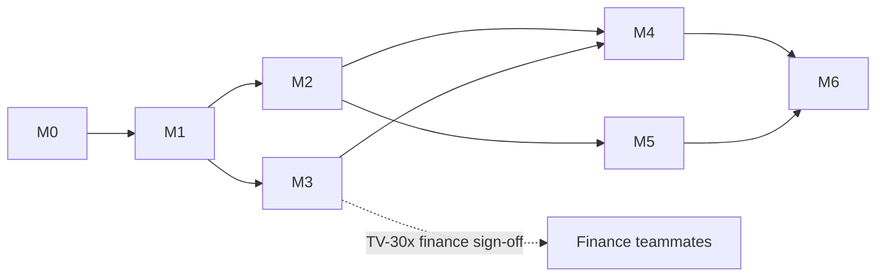

# Hackathon Delivery Plan

**Sizing caveat:** exact hackathon dates/duration unknown (GAP-02 / RES-001). The plan is expressed as ordered milestones with cut lines, not a calendar — compress by cutting from the bottom of each milestone's "polish" items, never by cutting tests on the engine.

## 1. Milestones (each independently demoable — vertical slices)

### M0 — Foundation (the slice that proves the skeleton)
Monorepo scaffold (structure per system-architecture §7) · Expo app boots on device (dev build, MMKV-ready) · i18n AR/EN + RTL flip via settings · design tokens + `Screen/Text/Button/Card/Amount(placeholder)` primitives · SQLite + Drizzle + first migration · CI green (format/lint/typecheck/test/boundaries) · Sentry wired (preview) · README quickstart works.
**Exit demo:** bilingual "hello dashboard" shell with tab nav, on a phone, from a fresh clone.

### M1 — Demo data & dashboard
`packages/domain` core (Obligation union, Money/Rate/LocalDate, status derivation + tests) · `packages/demo-data` v1 (date-anchored) · DemoSeedProvider + ImportService + repos · onboarding flow (lang→intro→consent→data choice) · SCR-HOME with real aggregates (`aggregates.v1`) + obligation cards + demo banner · SCR-OBL-LIST.
**Exit demo:** onboard → populated bilingual dashboard, all states (empty/loading/demo).

### M2 — Loan detail & histories
SCR-OBL-DETAIL-LOAN (unknown-field handling) · SCR-PAY-LIST + SCR-RATE-HIST · SCR-OBL-DETAIL-MURABAHA (terminology-correct, `murabahaProgress.v1` + INV-7 tests) · SCR-OBL-DETAIL-CARD (display) · glossary tap-through (FR-EDU-001) with first 10 education entries.
**Exit demo:** browse all three obligations with correct terminology in both languages.

### M3 — The engine ⭐ (highest risk, most value — starts as early as possible in parallel)
`finance-engine`: `amortization.v1`, `variableProjection.v1`, `residualDetection.v1`, `allocationEstimate.v1` + registry + CalculationRun persistence · vectors TV-1xx/2xx passing; **TV-30x filled by finance teammates and passing** · property tests INV-1..7 · SCR-RATE-IMPACT + SCR-EXPLAIN + SCR-OBL-SCHEDULE · insight rules (RATE_INCREASED, INSTALLMENT_UNCHANGED, RESIDUAL_RISK) + SCR-INS-CENTER.
**Exit demo:** the money shot — open loan → see residual warning → tap → full explanation with assumptions.

### M4 — Scenario planner ⭐
`extraPaymentScenario.v1` + vectors · SCR-SIM-LOAN (side-by-side, boundary language) · SCR-BANK-QUESTIONS · perf budget check (NFR-PERF-002).
**Exit demo:** "+50 JOD" visibly erases the residual — the emotional resolution.

### M5 — Manual entry & settings
SCR-OBL-ADD-TYPE/FORM (3 kinds, consistency notice BR-CALC-017) · SCR-PAY-ADD, SCR-RATE-ADD (validations) · SCR-SET complete (language, erase-all + test, reset demo, acknowledgments) · SCR-DATA-STATUS.
**Exit demo:** judge's own loan entered live in <2 minutes.

### M6 — Hardening & demo polish
Full AR walkthrough fixes (RES-009 review applied) · empty/error state sweep · Maestro demo-spine flows (EN+AR) green · a11y pass (labels, targets, contrast) · performance on demo device · security checklist · preview APK on 2 devices · demo script rehearsed ×3.

### Stretch queue (only after M6, in order)
S1 card payoff simulator (US-013, `cardPayoff.v1` + TV-6xx) → S2 local due reminders → S3 JSON export → S4 duplicate payment detection → S5 Supabase deploy (auth + cloud persistence; only if all else is polished — it changes the demo risk profile, discuss before doing).

## 2. Dependency graph

M3 (engine) can start against `packages/domain` as soon as M1's domain core exists — it has no UI dependency. If solo time-slicing: interleave M2 (UI-heavy) with M3 (logic-heavy) to avoid burnout on either.

## 3. Traceability matrix (Phase-5 consistency check — MVP features)

| Feature | FR | US | SCR | BR/Formula | Test | Milestone |
|---|---|---|---|---|---|---|
| Onboarding + consent | FR-ONB-001..005 | US-001 | SCR-ONB-* | — | RNTL + Maestro | M1 |
| Dashboard | FR-OBL-001/002, FR-CALC-006 | US-002 | SCR-HOME | aggregates.v1, BR-PROV-004/005, BR-STAT-002 | TV-7xx + RNTL | M1 |
| Loan detail | FR-OBL-003 | US-003/009 | SCR-OBL-DETAIL-LOAN | BR-CALC-016 | RNTL states | M2 |
| Murabaha | FR-OBL-004 | US-007 | SCR-OBL-DETAIL-MURABAHA | murabahaProgress.v1, BR-TERM-001, BR-CALC-020, INV-7 | TV-5xx + terminology test | M2 |
| Card display | FR-OBL-005 | US-008 | SCR-OBL-DETAIL-CARD | — | RNTL | M2 |
| Rate history/log | FR-RATE-001/002 | US-003 | SCR-RATE-HIST/ADD | BR-OBL-002, BR-RATE-001 | unit + RNTL | M2/M5 |
| Rate impact | FR-RATE-003/004 | US-003 | SCR-RATE-IMPACT | variableProjection.v1, residualDetection.v1 | TV-2xx/30x | M3 |
| Explanation | FR-CALC-001/005 | US-009 | SCR-EXPLAIN | run persistence | unit + RNTL | M3 |
| Insights | FR-INS-001..004 | US-012 | SCR-INS-CENTER | dedup rule | rule unit tests | M3 |
| Scenario | FR-SIM-001..003 | US-004 | SCR-SIM-LOAN | extraPaymentScenario.v1, INV-3 | TV-304 + Maestro | M4 |
| Payments | FR-PAY-001..003/005 | US-005 | SCR-PAY-LIST/ADD | allocationEstimate.v1 | TV-4xx | M2/M5 |
| Manual entry | FR-OBL-006/007 | US-006 | SCR-OBL-ADD-* | BR-CALC-017 | RNTL + Maestro | M5 |
| Education | FR-EDU-001..004 | — | SCR-LEARN* | content format | key-coverage | M2/M6 |
| Settings/erase | FR-SET-001..003/005 | US-010/011 | SCR-SET | — | absence test | M5 |
| Data status | FR-DATA-003 | — | SCR-DATA-STATUS | provider registry | RNTL | M5 |

(Every MVP FR appears; FR-PAY-004/FR-SET-004/FR-SIM-004/005/FR-NTF-001 are S-scope by design.)

## 4. Demo script (5 minutes) & fallbacks

1. *(20s)* Hook: "Omar has three obligations at three institutions. His bank raised his rate 14 months ago. His installment never changed. He thinks that's fine." Open app (Arabic), dashboard: totals, three cards, one amber insight.
2. *(60s)* Open loan → rate timeline → "installment unchanged" insight → impact screen: ≈ residual at maturity, ≈ added cost, "less of each payment reduces principal". Tap a figure → explanation: sources, formula version, assumptions — *"every number in this app can defend itself."*
3. *(60s)* "What can I do?" → scenario +50 JOD → side-by-side: residual gone, N months earlier, ≈ X JOD saved → bank-questions checklist.
4. *(45s)* Honesty beat: data-source screen — "demo data, manual entry today; CRIF/Open Banking are contracts we've designed, not connections we fake." Show Murabaha detail — "contract-aware, not word-swapped."
5. *(45s)* Switch to English live (RTL→LTR flip). Optionally add a judge's loan manually.
6. *(30s)* Close: architecture slide (engine isolation, tests, provenance) + post-hackathon path.

**Fallbacks:** APK on 2 devices + airplane mode (kills network risk) · pre-reset demo state before going on stage (FR-SET-005) · screen-recording of the full flow as last resort · if a screen breaks, the flow is re-enterable from dashboard at every step (no wizard lock-in).

## 5. Post-hackathon roadmap pointer
See `roadmap-and-risks.md` (P1: Supabase/auth/consent/sync → P2: providers → P3: notifications/analytics).
